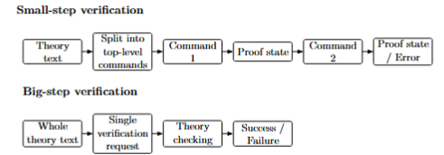
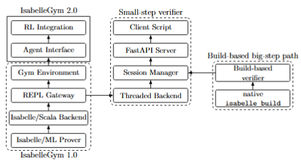
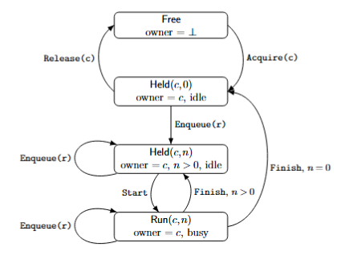
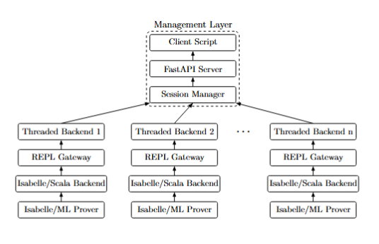
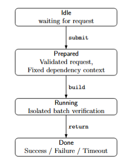
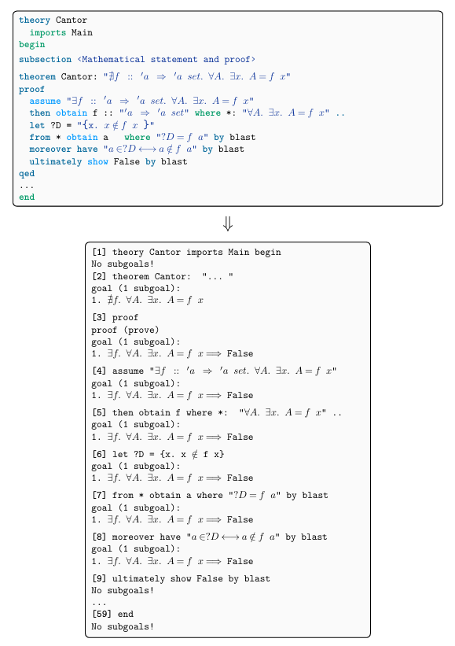
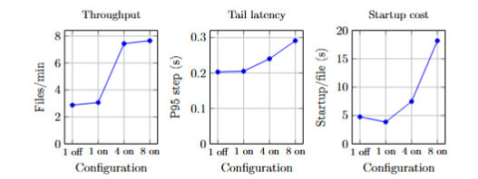

<div style="max-width: 1000px;">

## Motivation and backgrounds
### State of the art LLM based provers and their pipeline to ITPs
| Prover | relied ITP | Tool | Year | Link |
| ------ | ---------- | ---- | ---- |----------------- |
| Alpha Proof | Lean 4 | Closed source parallel Lean environment | 2025 | https://www.nature.com/articles/s41586-025-09833-y |
| Kimina Prover | Lean 4 | Kimina Lean Server | 2025 | https://arxiv.org/abs/2504.11354 |
| Aristotle | Lean 4 | Closed source REPL service wrapping community LeanREPL | 2025 | https://arxiv.org/abs/2510.01346 |
| Seed-Prover | Lean 4 | Direct Lean compiler | 2025 | https://arxiv.org/pdf/2507.23726 |
| DeepSeek Prover V2 | Lean 4 | Direct Lean compiler | 2025 | https://arxiv.org/abs/2504.21801 |
| Goedel-Prover-V2 | Lean 4 | Custom Lean REPL scheduler | 2025 | https://arxiv.org/abs/2508.03613 |
| BFS-Prover-V2 | Lean 4 | LeanDojo (step-level gym environment) | 2025 | https://arxiv.org/abs/2509.06493 |
| Draft-Sketch-Prove | Isabelle | PISA | 2023 | https://arxiv.org/abs/2210.12283 |
| LEGO-Prover | Isabelle | PISA | 2023 | https://arxiv.org/abs/2310.00656 |

1. Nowadays models are mostly based on Lean 4.
2. Lean has the advantages of more comprehensive community and mathematical proof tools.
3. Isabelle has its own advantages of intustrial usage and sledgehammer tool.
4. Training prover over Isabelle has been bottlenecked by the tools for interacting between training environment and Isabelle/ML.

### PISA, QIsabelle and their limitations
**Portal-to-ISAbelle (PISA)** was introduced by Albert Qiaochu Jiang, Wenda Li, Jesse Michael Han, and Yuhuai Wu in 2021. It supports automated proof search for Isabelle and can be used to run multiple instances of Isabelle for concurrent checking.

Pros:
1. PISA established the benchmark ecosystem for Isabelle-based neural theorem proving, systems like Thor, Magnushammer, Baldur, and DT-Solver all evaluate on the PISA benchmark.
2. PISA can run multiple copies of the Isabelle software in parallel, which is essential for large-scale proof search where thousands of theorems need to be evaluated under time budgets. It supports a socket-based parallel REPL infrastructure.

Cons:
1. It is based on scala/isabelle pipeline, which is a community contribution instead of an official pipeline. It is not stated that scala/isabelle is not as efficient as the official Isabelle/Scala, but it is stated by the official forum that Isabelle/Scala is more supported and suitable for system engineering.
2. The concurrency in PISA is actually by concurrently running Isabelle instances, that required copies of Isabelle softwares which consumes massive disk volume and RAM space, especially when Archieve of Formal Proofs (AFP) heaps are installed.
3. The support is limited up to Isabelle 2022, compactiblility to newer version is not updated.

**QIsabelle** is a lightweight, Docker-based reimplementation of PISA created by Marcin Wrochna. It support a running instance of PISA behind a HTTP server.

Pros:
1. QIsabelle provides a clean HTTP API with a thin Python client. The API is documented directly in the Scala source, and it strips away the corpus-extraction and multi-instance orchestration layers, focusing purely on the interactive proof-checking interface. 
2. QIsabelle is fully containerized, thus simple reproductivity is avaliable.
3. A newer version of Isabelle 2024 is supported.

Cons:
1. No built-in multi-instance parallelism. Unlike PISA, QIsabelle runs a single Isabelle server per container. Concurrent checking need multiple running containers, which is the same issue as local PISA.

This left the field with a vacancy of a concurrent, server-based, ease-to-use, reproducable with latest version of Isabelle and feature rich REPL-style checker that support both smallstep verification and bigstep verification.

Here, smallstep and bigstep means:

<div style="text-align: center;">
  
</div>

Smallstep is designed for stepwise output from the training/evaluation pipeline, that need the proof state and subgoals after each tactic applied. While bigstep is for a quick check of the correctness of a whole theory file.

### IsabelleGym series
IsabelleGym is a project proposed by Dr Wenda Li to build a REPL-style tool that utilise the official Isabelle/Scala pipeline. The project's first two iterations are the predecessors of this report.
1. IsabelleGym 1.0, by Tom Milan from University of Cambridge. It is the basestone of the project, it introduced the REPL style python wrapper utilising Isabelle/Scala pipeline.
2. IsabelleGym 2.0, by Zijing Li from University of Edinburgh. Li introduced a implementation level wrappe outside of IsabelleGym 1.0, and provided tools for agent based usage environment. A LRU cache is also introduced on the Scala level for faster session start time.

## Contributions
Therefore, we introduce IsabelleGym server, a concurrent, dual-mode (smallstep and bigstep) and server-based Isabelle verification tool.

| Tool | Concurrent | Instance reuse | Container based | Update avalaible | Official pipeline based |
| ---- | ---------- | -------------- | --------------- | ---------------- | ----------------------- |
| PISA | ✅         | ❌          | ❌           | ❌            | ❌                  |
| QIsabelle | ❌    | ❌          | ✅           | ❌             | ❌                 |
| IsabelleGym | ❌     | ✅        | ❌           | ✅            | ✅                   |
| IsabelleGym server | ✅          | ✅           | ✅           | ✅                   | ✅      |

### Structure

<div style="text-align: center;">
  
</div>

As illustrated by the structure, the server is utilising the contribution from IsabelleGym 1.0, 

### Smallstep verifier

#### Specification
The specification of the smallstep verifier section can be concluded as follow:

<div style="text-align: center;">
  
</div>

The concurrency of the sessions are guaranteed through a simple but strong lease protocol: a session can be owned by only one client at a time, only that client may submit commands, commands are executed sequentially by a single per-session worker, and a lease can be released only when the session is fully idle.

#### Foraml verification
We then verify this protocol in Isabelle/HOL to ensure the logic is correct, and designed concurrency is achieved.

**Lemma 1: Per-session serialisation**

Once a command has started running on a session, no second command can start on the same session until the first one finishes.
```
enabled (Start s) σ =⇒ ¬ enabled (Start s) (exec (Start s) σ).
```

**Lemma 2: Independence of distinct sessions**

If two distinct sessions s1 and s2 are both leased, both have non-empty queues, and neither is currently running, then Start s1 and Start s2 can be executed in either order with the same result.
```
exec (Start s1) (exec (Start s2) σ) = exec (Start s2) (exec (Start s1) σ).
```

#### Implementation
The implementation and the abstract engineering level view of the verifier can be concluded by the following illustration:

<div style="text-align: center;">
  
</div>

### Bigstep verifier

<div style="text-align: center;">
  
</div>

## Evaluation
As illustrated in the report, the evaluation is mainly focusing on 3 critarias:
1. Correctness
2. Efficiency
3. Scalability
Each statistic is computed from five independent runs.

### Datasets
**HOL-Analysis**
The HOL-Analysis library is an official dependency library from Isabelle/HOL, total including 93 theory files. It is commonly used for mathematical theorem proving as it consist popular mathematical theories such as Algebra, Infinite sum, Norm Arith, etc. 

We choose this corpus as it consist a relatively massive amount of import and estimated longer verification time (large proofs). This is suitable for *bigstep verification*, as we are able to test for import timeouts.

**HOL-Examples**
The HOL-Examples library is also an official dependency library from Isabelle/HOL, total including 16 theory files. This corpus in contract to HOL-Analysis, mostly relies on only HOL, which makes it suitable for smallstep verification as its theories are short, stylistically diverse, and have shallow import graphs.

#### Proof splitting

<div style="text-align: center;">
  
</div>

### Experiments
1. Baselines
2. Does the server layer hurt performance?
3. Does reuse and concurrency improve throughput?

**Table 1**
Bigstep overhead comparison on HOL-Analysis
| Tool | Total wall time (s)| Per theory (s) | File/min | Overhead/file (s) |
| ---- | ------------------ | -------------- | -------- | ----------------- |
| isabelle build (baseline) | 1254.576 | 13.482 | 4.449 | - |
| Server big-step | 1328.964 | 14.287 | 4.205 | 0.007 |

**Table 2**
Smallstep verifier baseline and alternatives on HOL-Examples
| Tool | Total wall time (s) | File/min | Startup/file (s) | Mean step (s) |
| ---- | ------------------- | -------- | ---------------- | ------------- |
| Local IsabelleGym 1.0 | 444.431 | 2.160 | 10.496 | 0.129 |
| QIsabelle | 2196.601 | 0.437 | 7.691 | 2.077 |
| Server small-step | 333.821 | 2.876 | 4.766 | 0.237 |

**Table 3**
Effectof session reuse and concurrent workers on smallstep throughput on HOL-Examples
| Configuration | Total wall time(s) |  File/min | Startup/file(s) | Mean step(s) |  P95 step(s) | Median wall/file(s) |
| ------------- | ----------------- | --------- | --------------- | ------------ | ------------ | ------------------- |
| 1 worker, reuse off | 333.821 | 2.876 | 4.766 | 0.237 | 0.203 | 11.529 |
| 1 worker, reuse on | 313.144 | 3.066 | 3.859 | 0.238 | 0.205 | 10.379 |
| 4 workers, reuse on | 129.075 | 7.438 | 7.470 | 0.243 | 0.240 | 22.066 |
| 8 workers, reuse on | 125.497 | 7.651 | 18.193 | 0.261 | 0.291 | 38.052 |

<div style="text-align: center;">
  
</div>

## Conclusion

## Limitations and further works

</div>